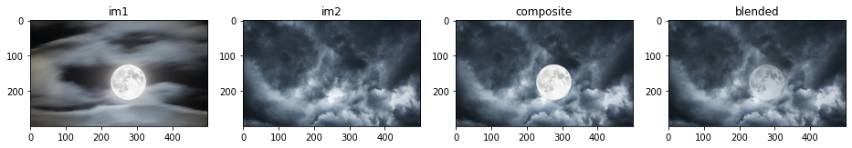
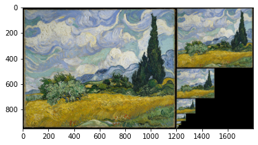

# Image-Blending

When you just combine two images together, the connection section looks sharp and unnatural. However, image blending is different because the connecting area is blended so that there are no visible seams or edges. In an blending algorithm, you input two images. The output would be the two images blended together. 

