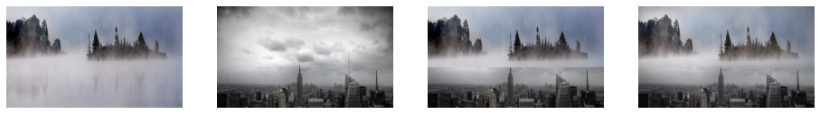
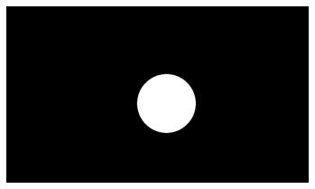

# Image-Blending

When you just combine two images together, the connection section looks sharp and unnatural. However, image blending is different because the connecting area is blended so that there are no visible seams or edges. In an blending algorithm, you input two images. The output would be the two images blended together. 

A Gaussian Pyramid consists of downsampled images by a factor of two. The input is an image. The output is a downsampled image. To generate a Gaussian pyramid, you first need to smooth the image. Then, you downsample by a factor of 2. You repeat this process until you reach the desired downsample factor. Downsampling an image is decreasing the dimensions or pixels by choosing every other pixel. 

Smoothing an image is making each pixel the average of the pixels around it. This removes sharp edges and blurs the image. If you don't smooth the image before downsampling, it makes the image aliased. This makes the image look pixelated and uneven. The convolution operation is used to smooth the image by averaging each pixel with the pixels around it. The kernel used in this operation decides how large the averaging area for each pixel would be and the weight of each pixel. The larger the kernel, the more smoothed the image would look because you are taking the average of a larger area.

A Laplacian pyramid is the difference between a Gaussian pyramid and the upsampled next Gaussian pyramid. You could either input a Gaussian pyramid or the original image and the desired level. To get the Laplacian pyramid, generate the Gaussian pyramid(if it wasn’t imputed) and subtract the upsampled next Gaussian pyramid. Collapsing a Laplacian pyramid is to find the full resolution image with a Laplacian pyramid

This is the mathematical relationship between the Gaussian and Laplacian pyramids.

To upsample an image, you expand a image and make the new pixels the average of the pixels around it.

To blend two images, you need to do the following steps:

1. Combine the images using the mask and find the top-level Gaussian pyramid
2. Build the Laplacian pyramid from the Laplacians of the images
3. Build the Gaussian pyramid from the mask
4. Form the combined Laplacian pyramid from the Laplacians using the Gaussian pyramid mask
5. Collapse the combined Laplacian pyramid to get final blended image

The mask is used to help assign images to different parts.

